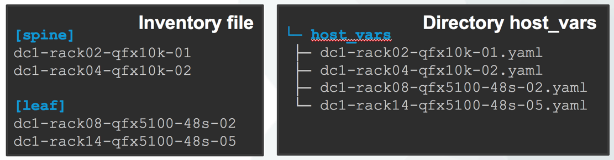
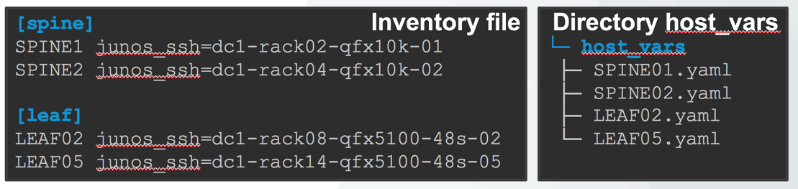
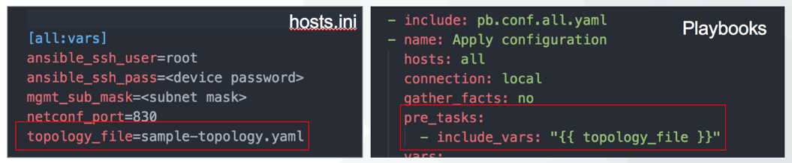
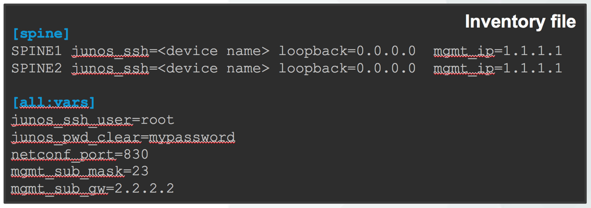

How to create an Ansible project abstracted from the physical devices
=====================================================================

Automation projects for networks devices are often very specific to a particular
set of physical devices because of the physical topologies of these devices and how they are connected to each other.
There are multiple situations where it’s important and very useful to be able
to reuse the same automation projects across multiple “network” or group of devices, to name a few:

 - Production network with multiple sites
 - Configuration validation between production and pre-production networks
 - Dynamic/multiple lab environments

Even if you are able to share configuration templates across different projects,
there are many information that are difficult to share or reuse. When you want
to reuse one project between multiple topology you have to change
many information: devices name, interfaces name, IPs etc …

With Ansible, this challenge is solved using dynamic inventory to dynamically
load inventory information and device specific variables. Dynamic inventory
is working great for deployment in production but require a back-end system
that will store all information. For smaller deployment and for lab most people
usually keep their inventory and variables in files stored on the local file system. (TODO, Add link to dynamic inventory)
Using static inventory and variables defined in local yaml files,
it’s possible to make a project easy to reuse across multiple physical topologies.

By using the 3 following steps you’ll be able to create to abstract your project from your physical topology:

 - Use alias for device in the inventory file
 - Centralize all physical information related to a given physical topology in a central topology file
 - Define remaining variables specific to a given topology in the inventory file

1/ Use alias for device in the inventory file
---------------------------------------------

The inventory file is one of the main components of Ansible, it contains a lot
of information including devices names and groups.
The name you use to define your device is very important because it is used in
many other places inside ansible. For example, variables are classified per
devices using the name defined in the inventory, also available with the
variable “inventory_hostname”.

It’s seam natural to use the real name of your devices in the inventory file
but by doing so you’ll make it difficult to reuse your project across multiple devices.
It’s possible to keep your project portable by using an alias in the inventory
and create a new variable that contain the real name or IP of the device

2/ Centralize all physical information related to a given physical topology in a central topology file
------------------------------------------------------------------------------------------------------

To prevent very specific information like interfaces name to be duplicated and
dispersed everywhere in the project. It possible to centralize them and give them an alias as well.

In this example, I put all information related to my physical layer (interface name, peer etcc .. )
in a central file. (sample-topology.yaml)
Each interfaces get assigned an alias here: port1, port2 port3.
It could be something more meaning full like: to_spine1, to_spine2
All information are stored under a variable named ``topo`` and each device has
it’s own section identified with the device name used in the inventory.

Everywhere else, when you need to access the name of an interface you can access
it by its variable ``{{ topo[inventory_hostname].port1.name }}``

.. NOTE::
    Inventory_hostname is a variable itself and will be automatically replaced with the name of the device used in the inventory, for example: fabric-01

The topology file itself is defined in the inventory file and is loaded at the beginning at each playbook.

.. NOTE::
    The creation of a variable in the inventory file allow to keep the playbook independent of the topology as well

3/ Define remaining variables specific to a given topology in the inventory file
--------------------------------------------------------------------------------

Remaining information that are device specific like management IP, loopback address etc .. can be defined in the inventory file directory.
It’s possible to define any type of variable in the inventory file, either per device or per group


